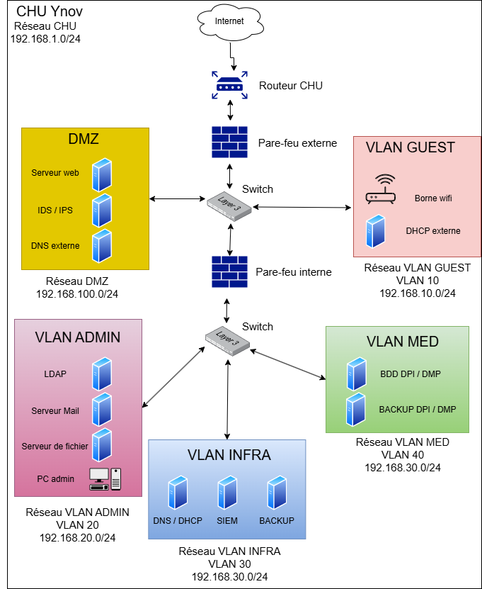

# Introduction 

Ce projet vise à concevoir et sécuriser l’infrastructure d’un hôpital fictif.  
Les hôpitaux sont des cibles privilégiées pour les cyberattaques en raison de la nature critique et sensible de leurs données.

Ce document a pour but de décrire l'infrastructure d'un centre hospitalier universitaire.  
Il détaillera l'architecture du SI, les règles de sécurité mises en place, ainsi que l’évolutivité et la résilience du système.

**Vous trouverez la configuration des éléments du SI dans le document `doc-configuration.md`.**

---
# Présentation générale du SI du CHU

Le réseau du CHU est divisé en plusieurs sous-réseaux virtuels appelés VLAN.  
En effet, les VLANs présentent un réel intérêt pour notre CHU, notamment :
- **Sécurité renforcée** : les machines situées dans des VLANs différents ne peuvent pas communiquer directement sans passer par un pare-feu ou un routeur.
- **Segmentation logique** : le réseau est organisé par service.
- **Performances améliorées** : la segmentation réduit la charge sur le réseau global.
- **Gestion centralisée** : cela simplifie la gestion du réseau, ce qui est utile pour les grandes infrastructures.

Maintenant que nous avons compris l'intérêt de déployer des VLANs dans notre infrastructure, détaillons celle de notre CHU :

| VLAN ID | Nom   | Utilité                        | Equipements                            |
| ------- | ----- | ------------------------------ | -------------------------------------- |
| 10      | GUEST | Accès Internet publique        | Wi-Fi visiteurs, DHCP visiteurs        |
| 20      | ADMIN | Accès RH, direction            | Serveur mail, LDAP, Serveur de fichier |
| 30      | INFRA | Services critiques             | DNS / DHCP, SIEM, Serveur de backup    |
| 40      | MED   | Matériel médical, DPI          | Radiologie, DPI, Serveur de backup DPI |
| 100     | DMZ   | Services exposés à l’extérieur | Serveur web, DNS externe, IDS/IPS      |

---
# Schéma réseau

---
# Architecture technique

## Réseau

L'infrastructure de notre SI est divisée en deux zones : une zone dite **no trust**, accessible à tout le monde, et une zone dite **safe**, accessible uniquement aux composants de l'infrastructure et au personnel sur site.

La zone **no trust** est protégée par un pare-feu externe qui gère les menaces depuis Internet et le réseau public du CHU.

La zone **safe** est protégée par un pare-feu interne qui gère les menaces depuis l’intérieur du réseau privé.

Comme nous l’avons vu, l’infrastructure réseau est segmentée en plusieurs VLAN afin d’isoler les différents types de trafic.  
Chaque VLAN dispose de ses propres règles de filtrage pour limiter la communication entre eux selon le principe du moindre privilège leurs routage est assuré par les switch.

Les **postes de travail** sont situés dans le sous-réseau `ADMIN`. 
Seul le personnel connecté au VLAN `ADMIN` sont autorisé à modifier les données sur les serveurs **DPI / DMP**.

Les **serveurs** constituent le cœur même du système d’information. 
Ils hébergent l’ensemble des services réseau mis en place et sont répartis à travers différents sous-réseaux afin de gérer les droits d’accès selon le type de service.

Les **pare-feux** sont configurés pour appliquer des politiques strictes entre les sous-réseaux et ainsi contrôler le trafic entrant et sortant, des règles basées sur les ports, protocoles et adresses IP permettent de filtrer les communications. 

Le système **IDS/IPS** analyse en temps réel le trafic réseau afin de détecter, signaler et bloquer les tentatives d’intrusion. 
Il s’appuie sur des signatures connues ainsi que sur des mécanismes de détection comportementale.

Le **SIEM** permet de centraliser les logs de l’ensemble du système d’information, offrant ainsi une vision globale de l’activité et facilitant la détection d’anomalies.

Il est essentiel d’isoler les données médicales du reste de l’infrastructure, car ces données sont hautement sensibles.  
Une fuite ou un accès non autorisé pourrait entraîner des conséquences graves telles qu'une atteinte à la vie privée des patients, des tentatives de chantage, des formes de discrimination ...

L’isolement réseau permet également de limiter les risques de propagation d’une attaque à l’ensemble du système, garantissant ainsi la continuité de service.
## Systèmes 

Nous utilisons **Debian 12** sur l’ensemble de notre infrastructure, car cette distribution présente de nombreux avantages adaptés à un environnement critique comme celui du secteur médical.

Avantages de Debian :
-  **Grande stabilité** : essentielle pour assurer un fonctionnement fiable des services en production.
-  **Uniformisation** : tous les services (serveurs, pare-feu, IDS/IPS…) tournent sur le même système, évitant les mélanges de distributions.
- **Contrôle total** : Debian n’exécute aucun service caché ou non documenté, offrant une transparence maximale.
- **Compatibilité logicielle** : elle supporte tous les outils nécessaires à notre infrastructure (serveurs web, outils de sécurité, systèmes de monitoring, etc.).
- **Mises à jour régulières et maîtrisées**, sans provoquer d’instabilités.
- **Déploiement facilité**, ce qui est un avantage dans un environnement **scalable** où l’ajout de machines doit être rapide et cohérent.

---
# Services hébergés

Pour le bon fonctionnement de notre CHU, nous aurons besoin de plusieurs services que nous allons lister :

| Service            | Rôle                                      | Solution        | Justification                                                                               |
| ------------------ | ----------------------------------------- | --------------- | ------------------------------------------------------------------------------------------- |
| Base de données    | Stockage des données                      | MySQL           | Base de données populaire, stable, bien supportée sur Debian                                |
| Serveur web        | Portail d'accueille du site               | Apache          | Solution mature, stable et flexible                                                         |
| Serveur mail       | Gestion des mails                         | Postfix         | Serveur mail léger, sécurisé, performant et facile à administrer                            |
| Serveur de fichier | Centralisation de fichiers                | Samba           | Gestion avancée des droits, bonne stabilité.                                                |
| Serveur de Backup  | Sauvegarde des données                    | Bacula          | Solution complète de sauvegarde réseau, supporte planification et restauration granulaires. |
| Pare-feu           | Filtrage et contrôle des flux réseau      | iptables        | Outil natif Linux, puissant et flexible                                                     |
| IDS/IPS            | Détection et prévention d’intrusions      | Snort           | IDS/IPS éprouvé, large communauté, base de règles complète                                  |
| SIEM               | Collecte et centralisation des logs       | Splunk          | Solution puissante et scalable                                                              |
| DNS                | Résolution de noms de domaine             | Bind9           | Serveur DNS standard, fiable pour les environnements critiques.                             |
| DHCP               | Attribution dynamique d’adresses IP       | ISC DHCP        | Solution robuste, largement utilisée, simple à configurer sous Debian.                      |
| LDAP               | Gestion des utilisateurs et groupes\|     | OpenLDAP        | open source, bien intégrée dans les environnements Linux.                                   |
| Poste de travail   | Utilisation quotidienne et administration | Debian 12 GNOME | Environnement stable et sécurisé, interface graphique conviviale pour administration.       |

---
# Implantation et répartition des services

Le tableau ci-dessous récapitule l’ensemble des machines du SI, classées par VLAN, avec leur fonction et leur adresse IP :

| Machine         | VLAN | Rôle                            | Adresse IP        |
| --------------- | ---- | ------------------------------- | ----------------- |
| `fw-01`         |      | Pare-feu externe                | 192.168.1.2       |
| `fw-02`         |      | Pare-feu interne                | 192.168.1.3       |
| `sw-01`         |      | Switch externe                  | 192.168.1.4       |
| `sw-02`         |      | Switch interne                  | 192.168.1.5       |
| `web-01`        | 100  | Serveur web                     | 192.168.100.2     |
| `ids-01`        | 100  | IDS / IPS                       | 192.168.100.3     |
| `dns-01`        | 100  | DNS externe                     | 192.168.100.4     |
| `dhcp-01`       | 10   | DHCP externe                    | 192.168.10.2      |
| `wifi-01`       | 10   | Borne wifi invité               | 192.168.10.3      |
| `ldap-01`       | 20   | LDAP                            | 192.168.20.2      |
| `srv-mail-01`   | 20   | Serveur mail                    | 192.168.20.3      |
| `srv-share-01`  | 20   | Serveur de fichier              | 192.168.20.4      |
| `pc-admin`      | 20   | Poste de travail administration | attribué par DHCP |
| `dns-dhcp-02`   | 30   | DNS + DHCP interne              | 192.168.30.2      |
| `siem-01`       | 30   | SIEM                            | 192.168.30.3      |
| `srv-backup-01` | 30   | Serveur de backup               | 192.168.30.4      |
| `srv-bdd-01`    | 40   | Base de donné DPI / DPM         | 192.168.40.2      |
| `srv-backup-02` | 40   | Serveur de backup DPI / DPM     | 192.168.40.3      |

---

# Matrice de flux

Une matrice de flux est un outil essentiel en administration réseau. Elle permet d’identifier les communications réseau autorisées entre les machines, et de limiter les flux inutiles ou dangereux.

## Matrice de flux **autorisés**

Dans une logique de principe du moindre privilège, tous les flux non listés dans cette matrice sont strictement bloqués.

|     Source      |  Destination   |  Port / Protocole  |             Justification              |
| :-------------: | :------------: | :----------------: | :------------------------------------: |
|   `pc-admin`    |   `ldap-01`    |     389 / LDAP     |      Authentification centralisée      |
|   `pc-admin`    | `srv-share-01` |     445 / SMB      |       Accès aux partages réseau        |
|   `pc-admin`    | `srv-mail-01`  |     587 / SMTP     |           Envoi de courriels           |
|   `pc-admin`    | `dns-dhcp-02`  | 53, 67 / DNS, DHCP |   Résolution de noms et IP dynamique   |
|   `pc-admin`    |  `srv-bdd-01`  |    3306 / MySQL    |       Accès à la base DPI / DMP        |
|   `pc-admin`    |    `web-01`    |    443 / HTTPS     |       Accès à l’application web        |
|    `wifi-01`    |    `dns-01`    |      53 / DNS      |      Résolution DNS pour invités       |
|    `wifi-01`    |    `web-01`    |    443 / HTTPS     |          Accès au site public          |
|    `dhcp-01`    |   `wifi-01`    |     67 / DHCP      |    Attribution IP pour les invités     |
|    `web-01`     |  `srv-bdd-01`  |    3306 / MySQL    |   Connexion à la base de données DPI   |
|    `web-01`     |   `ldap-01`    |     389 / LDAP     |          Authentification web          |
|    `web-01`     | `srv-share-01` |     445 / SMB      |     Accès aux fichiers nécessaires     |
|    `web-01`     |    `dns-01`    |      53 / DNS      |             Résolution DNS             |
|    `ids-01`     |    `web-01`    |         *          |       Surveillance du trafic DMZ       |
|    `ids-01`     |    `dns-01`    |         *          |      Analyse du trafic DNS invité      |
|    `ids-01`     |   `dhcp-01`    |         *          |         Analyse du DHCP invité         |
|    `siem-01`    |    `ids-01`    |    514 / Syslog    |        Collecte des logs réseau        |
|    `siem-01`    | `srv-mail-01`  |     25 / SMTP      |         Notification d’alertes         |
|    `siem-01`    |       *        |         *          |          Supervision complète          |
| `srv-backup-01` | `srv-share-01` |    873 / rsync     |    Sauvegarde des fichiers partagés    |
| `srv-backup-01` | `srv-mail-01`  |    873 / rsync     |          Sauvegarde des mails          |
| `srv-backup-02` |  `srv-bdd-01`  |    873 / rsync     |       Sauvegarde de la base DPI        |
|  `dns-dhcp-02`  |   `ldap-01`    |     389 / LDAP     |     Authentification pour DHCP/DNS     |
|  `srv-mail-01`  |   `ldap-01`    |   389 / TCP LDAP   | Authentification des utilisateurs mail |

---
# Sécurité

Il est essentiel de mettre en place des mesures de sécurité au sein de notre SI, compte tenu de la nature critique et confidentielle des données de santé qu’il traite.

Ces mesures visent à protéger les données sensibles, garantir la continuité des soins et répondre aux obligations réglementaires, notamment celles liées à la certification **HDS** et au **RGPD**.

Mesures de sécurité mises en place dans le SI hospitalier :

| **Objectif **                        | **Mesure de protection**                  | **Détail**                                                                                | **Conformité RGPD / HDS**                                                                                   |
| ------------------------------------ | ----------------------------------------- | ----------------------------------------------------------------------------------------- | ----------------------------------------------------------------------------------------------------------- |
| Contrôle des accès réseau            | Segmentation via VLANs                    | Isolation des flux entre services                                                         | **HDS** : séparation logique des flux **RGPD :** limitation des traitements par fonction                 |
|                                      | Switchs de niveau 3                       | Routage inter-VLAN sécurisé avec règles de filtrage intégrées                             | **HDS** : segmentation renforcée  **RGPD** : cloisonnement des accès                                     |
|                                      | Double pare-feu (interne et externe)      | Protection des intrusion interne et externe                                               | **HDS** : cloisonnement et surveillance du trafic  **RGPD** : protection renforcée contre les intrusions |
|                                      | Accès restreints rôle                     | Attribution fine des droits selon les profils utilisateurs (via LDAP)                     | **RGPD** : principe du moindre privilège  **HDS** : contrôle des accès                                   |
|                                      | Port Security                             | Blocage des connexions physiques non autorisées sur les ports réseau                      | **HDS** : sécurisation physique des accès réseau                                                            |
| Authentification et identification   | LDAP avec gestion des rôles et accès      | Gestion centralisée des utilisateurs et affectation des droits par groupe                 | **RGPD** : traçabilité des accès  **HDS** : gestion fine des droits d’accès                              |
|                                      | Authentification forte (2FA)              | Double facteur requis pour les interfaces critiques et services sensibles                 | **RGPD et HDS** : sécurisation des accès aux données sensibles                                              |
| Journalisation et surveillance       | SIEM                                      | Centralisation, corrélation et analyse des logs de tous les équipements et services       | **RGPD** : détection d’incidents   **HDS** : obligation de traçabilité et d’alerte                       |
| Chiffrement et confidentialité       | Chiffrement des données en transit (TLS)  | Utilisation de TLS pour LDAP, messagerie, accès web et flux internes                      | **RGPD** : sécurisation des transmissions de données   **HDS** : chiffrement requis                      |
|                                      | Chiffrement des données au repos          | Chiffrement de disques durs                                                               | **RGPD et HDS** : protection des données stockées contre vol ou accès non autorisé                          |
| Résilience et haute disponibilité    | Liens internet redondants                 | Multi-fournisseur ou double liaison pour éviter toute perte de connectivité               | **HDS** : disponibilité et continuité de service                                                            |
| Protection des données et sauvegarde | Sauvegardes régulières automatisées       | Sauvegardes quotidiennes                                                                  | **RGPD** : protection contre perte de données   **HDS** : sauvegardes obligatoires                       |
|                                      | Serveur de sauvegarde dédié (DPI/DPM)     | Déploiement de serveur dédié à la sauvegarde sécurisée des dossiers patients informatisés | **HDS** : sauvegarde sécurisée des DPI **RGPD** : intégrité et disponibilité des données personnelles    |
| Protection contre les attaques       | IDS/IPS                                   | Détection et blocage des attaques réseau                                                  | **RGPD** : prévention des violations **HDS** : détection des incidents de sécurité                       |
|                                      | Mise à jour régulière des firmwares et OS | Patchs de sécurité appliqués régulièrement sur tous les systèmes                          | **RGPD et HDS** : correction proactive des vulnérabilités connues                                           |
|                                      | blocage d’adresses IP malveillantes       | blacklist automatique d’IP suspectes                                                      | **RGPD** : réduction des vecteurs d’intrusion  **HDS** : protection active du réseau                     |

---
# Bonnes pratiques

L'architecture de notre SI intègre plusieurs **bonnes pratiques de sécurité réseau**, essentielles dans un environnement aussi critique que notre CHU.
## 1. Segmentation réseau par VLAN 

- **VLAN GUEST** (192.168.10.0/24) pour les visiteurs, isolé du reste du réseau.
- **VLAN ADMIN** (192.168.20.0/24) réservé aux services d'administration internes.
- **VLAN INFRA** (192.168.30.0/24) pour les services d'infrastructure (DNS, SIEM, sauvegardes).
- **VLAN MED** (192.168.40.0/24) pour les données médicales critiques (DPI/DMP).
- **DMZ** (192.168.100.0/24) pour les services exposés (web, DNS, IDS/IPS).

Les services sont séparés par usage et niveau de sensibilité grâce aux VLANs, ce qui limite les déplacements latéraux en cas d’intrusion.

## 2. Double pare-feu (externe + interne)

Un pare-feu externe filtre le trafic entrant/sortant vers Internet, tandis qu’un pare-feu interne contrôle les communications entre les VLANs.

## 3. DMZ isolée

Les services exposés à l’extérieur (web, DNS, IDS/IPS) sont isolés dans une zone **DMZ**.  
Cette zone tampon permet de contenir une éventuelle compromission.  
Tout trafic vers le réseau interne transite obligatoirement par le pare-feu.

## 4. Principe du moindre privilège

Les utilisateurs invités sont isolés, les services critiques séparés, et les communications inter-VLAN sont strictement limitées par des règles explicites.
Le VLAN `GUEST` n’a aucun accès aux VLAN internes.

## 5. Infrastructure réseau en couche 3

Un switch de niveau 3 assure le routage inter-VLAN, permettant un contrôle précis des flux réseau entre les différentes zones.

## 6. IDS/IPS dans la DMZ

L’IDS/IPS est placé entre la DMZ et le réseau interne.
Il permet de détecter et prévenir les intrusions dès l’entrée dans le réseau, renforçant ainsi la surveillance des flux entrants.

## 7. Serveur de sauvegarde dédié

Le serveur de sauvegarde, intégré au VLAN INFRA, est isolé du reste du réseau.
Il permet une restauration rapide des données critiques en cas d’attaque ou de défaillance, un élément clé contre les ransomwares.

## 8. Centralisation des journaux avec SIEM

Le SIEM, intégré au VLAN INFRA, centralise et corrèle les logs pour une détection efficace des incidents.
Il assure la surveillance en temps réel et l’analyse des événements système, facilitant l’identification d’anomalies ou d’intrusions.

## 9. DHCP séparé pour le réseau invité

Un serveur DHCP est dédié au VLAN `GUEST`.
Cela empêche les visiteurs de recevoir des configurations réseau internes et réduit le risque d’attaques de type DHCP spoofing.

